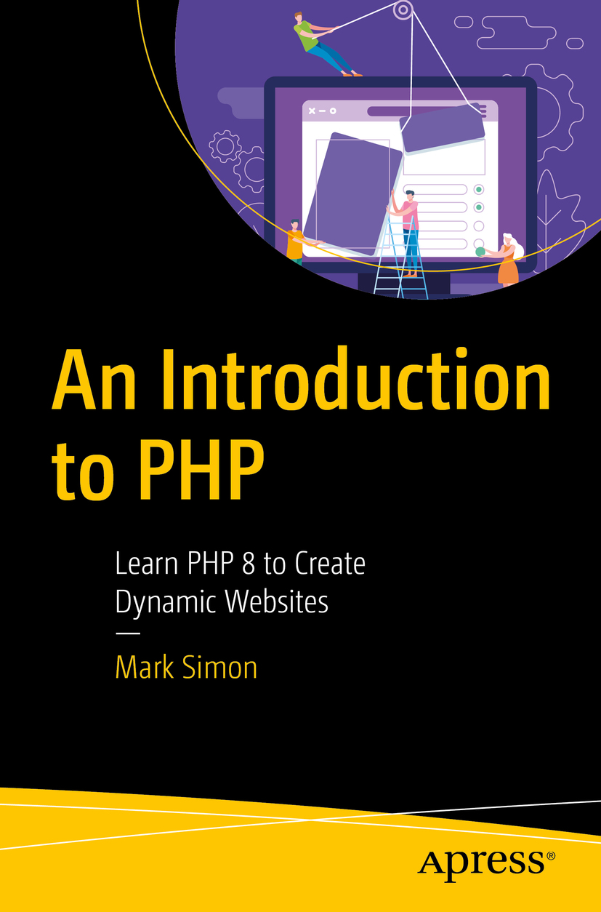

# Apress Source Code

This repository accompanies [*An Introduction to PHP*](https://link.springer.com/book/10.1007/979-8-8688-0177-8) by Mark Simon (Apress, 2024).

[comment]: #cover

To work through the book, you’ll want a working coding and testing environment. The instructions can be found in Chapter 1 of the book. Here, we’ll link to the software you might like to use.

##  Sample Files

##  A Coding Editor

There are many good coding editors available, some of which are open-source, some of which are proprietary, and some of which you might pay for.

Here are two good free and open-source editors you might consider:

-	Pulsar: https://pulsar-edit.dev/

 This is the successor to the Atom Text Editor.

-	VSCodium: https://vscodium.com/

	This is the open source of Microsoft’s Visual Studio Code (https://code.visualstudio.com/), without Microsoft’s specific telemetry and proprietary features.

##	A Web Server

If you’re using Macintosh or Windows, they don’t come with a suitable web server. You can down load one of the following:

-	XAMPP: www.apachefriends.org/download.html.

	Download and install the latest version for your
operating system.

-	MAMP: www.mamp.info/en/downloads/.

	You won’t need the MAMP Pro version for anything in this book.

##  The Virtual Hosts Application

In the book we work with a __Virtual Host__. This can be a little tricky to set up, so Virtual Host application can be used to make it easier:

-	https://github.com/manngo/virtual-hosts/releases/latest

The application can also be used to make changes to the PHP setup and includes a tab to test snippets of PHP code.

Download the files as a zip using the green button, or clone the repository to your machine using Git.

## Releases

Release v1.0 corresponds to the code in the published book, without corrections or updates.

## Contributions

See the file Contributing.md for more information on how you can contribute to this repository.
